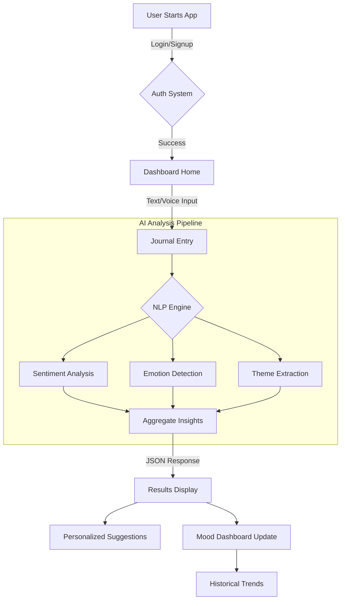

<div align="center">

# 🌟 Emotion Companion AI
### Your Intelligent Partner for Emotional Wellness

[](https://python.org)
[](https://streamlit.io)
[](https://fastapi.tiangolo.com)
[](https://supabase.com)
[](https://opensource.org/licenses/MIT)

[Overview](#-overview) • [Features](#-features) • [Installation](#-installation) • [Quick Start](#-quick-start) • [Tech Stack](#-technology-stack) • [Contributing](#-contributing)

</div>

---

## 🌟 Overview

**Emotion Companion AI** is a production-grade meaningful AI application designed to support mental well-being. It goes beyond simple journaling by using advanced Natural Language Processing (NLP) to understand your emotions, track your mood trends, and provide clinically-grounded coping strategies in real-time.

**Why This Project?**
*   ✅ **Real-time Analysis**: Instant feedback on your emotional state.
*   ✅ **Privacy First**: Secure, encrypted storage with user ownership.
*   ✅ **Multi-Modal**: Supports both text and voice journaling.
*   ✅ **Evidence-Based**: Suggestions based on CBT (Cognitive Behavioral Therapy) principles.
*   ✅ **Beautiful UI**: Modern, calming "Glassmorphism" design.

---

## ✨ Features

### 🎯 Core Capabilities

| Feature | Description |
| :--- | :--- |
| **🧠 Deep Emotional Analysis** | Detects subtle emotions (Joy, Fear, Surround, etc.) not just Positive/Negative. |
| **🎤 Voice Journaling** | Record your thoughts on the go; we transcribe and analyze them instantly. |
| **📊 Smart Dashboard** | Visualize your mood trends over time with interactive charts. |
| **💡 Actionable Insights** | Get personalized, context-aware suggestions (e.g., "Try Box Breathing"). |
| **🛡️ Secure Auth** | Full user management system with secure login/signup via Supabase. |

### 🔧 Technical Highlights

*   **Dual-Engine NLP**: Uses Transformer models (HuggingFace) for accuracy, with a lightweight fallback for speed.
*   **Scalable Backend**: Built on FastAPI with connection pooling for high concurrency.
*   **Reactive Frontend**: Streamlit interface optimized for user engagement.
*   **Cloud Native**: Docker-ready and designed for microservices deployment.

---

## � Application Workflow



---

## �🚀 Quick Start

### Prerequisites
*   Python 3.10+
*   PostgreSQL (or Supabase account)

### Installation (5 minutes)

1.  **Clone the repository**
    ```bash
    git clone https://github.com/Start-Up-Pratik/emotion-companion.git
    cd emotion-companion
    ```

2.  **Install Dependencies**
    ```bash
    pip install -r requirements.txt
    python -m spacy download en_core_web_sm
    ```

3.  **Configure Environment**
    Create a `.env` file:
    ```env
    SUPABASE_URL="your-project-url"
    SUPABASE_KEY="your-anon-key"
    SECRET_KEY="your-secret-key"
    ```

4.  **Run the App**
    ```bash
    # Run the startup script (Windows)
    run_app.bat
    ```

    *The app will open automatically at `http://localhost:8501`*

---

## 🛠️ Technology Stack

| Layer | Technology | Purpose |
| :--- | :--- | :--- |
| **Frontend** | Streamlit | Responsive, interactive UI |
| **Backend** | FastAPI | High-performance API |
| **Database** | PostgreSQL | Relational data storage |
| **Auth/Storage** | Supabase | User management & asset hosting |
| **AI/ML** | HuggingFace / NLTK | Sentiment & Emotion classification |
| **Visualization** | Plotly | Interactive data charts |

---

## 📂 Project Structure

```bash
emotion-companion/
├── 📂 backend/              # FastAPI Application
│   ├── app.py             # API Entry Point
│   ├── models.py          # Pydantic Schemas
│   └── nlp.py             # AI Logic Core
│
├── 📂 streamlit_app/        # Frontend Application
│   ├── app.py             # UI Entry Point
│   ├── app_premium.py     # Advanced UI Components
│   └── wellness_integration.py # Interactive Tools
│
├── 📂 deploy/               # Deployment Guides
├── requirements.txt         # Dependencies
└── run_app.bat             # One-click startup script
```

---

## 🤝 Contributing

Contributions are welcome! Please read our [Contributing Guide](CONTRIBUTING.md) for details.

1.  Fork the Project
2.  Create your Feature Branch (`git checkout -b feature/AmazingFeature`)
3.  Commit your Changes (`git commit -m 'Add some AmazingFeature'`)
4.  Push to the Branch (`git push origin feature/AmazingFeature`)
5.  Open a Pull Request

---

## 📄 License

Distributed under the MIT License. See `LICENSE` for more information.

---

<div align="center">

**Made with ❤️ for Mental Health Awareness**

</div>
